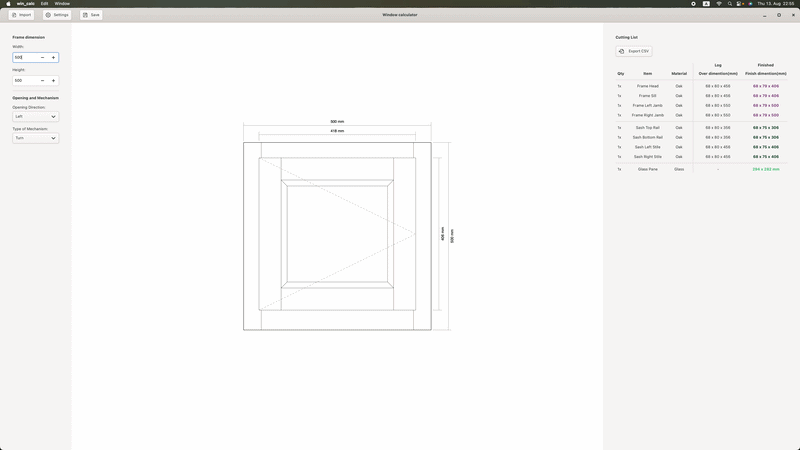

# Window Calculator (`win_calc`)

A GTK4 desktop application written in C for calculating window sash dimensions, profile geometries, and generating automated cut lists.



## Why

I built this project as an experimental tool to practice C programming using a domain I'm familiar with: wooden window construction. It served as a practical playground for learning GTK4 GUI development and Cairo rendering.

## Features

- **Dynamic CAD Preview**: Renders frame, sash, and opening directions (tilt & turn) on a Cairo drawing canvas.
- **Parametric Math Engine**: Derives exact sash and profile cut lengths from the external frame dimensions.
- **Cut List Generation**: Tabular output breaking down logs with overdimention of :
  - Frame head, sill, left & right jamb.
  - Sash top & bottom rail, left & right stile.
  - Glass panel.
- **Config Persistence**: Save and reload custom profile profiles (`.ini`) and project states (`.win`) via `GKeyFile`.

## Stack

- **Language**: C (C11)
- **GUI Toolkit**: GTK 4.x & Cairo 2D
- **Build System**: GNU Make / Meson
- **Environment**: Flatpak SDK (GNOME 49) or Native host
- **Platform**: Linux / GNOME Desktop or Mac OS

## Run it

You can build and run this project natively or inside a sandboxed Flatpak container.

### Option 1: Native Build (Local Dependencies)

Requires GTK4 installed on your host system (`libgtk-4-dev`).

```bash
# Install dependencies (Debian/Ubuntu)
sudo apt update && sudo apt install -y build-essential libgtk-4-dev

# Compile and run
make
./win_calc
```

### Option 2: Flatpak Container Build (GNOME SDK 49)
If you don't have GTK4 installed locally and you dont have sudo privileges, the Makefile can automatically fetch org.gnome.Sdk//49 and compile using Meson inside Flatpak:

```bash
# Build inside GNOME SDK 49 container
make meson

# Run the app inside the container
make run
```
### Prerequisites 
### Linux (Ubuntu / Debian)
```bash
sudo apt update && sudo apt install -y build-essential libgtk-4-dev meson ninja-build
```
### macOS
```
brew install gtk4 meson ninja pkg-config
```


